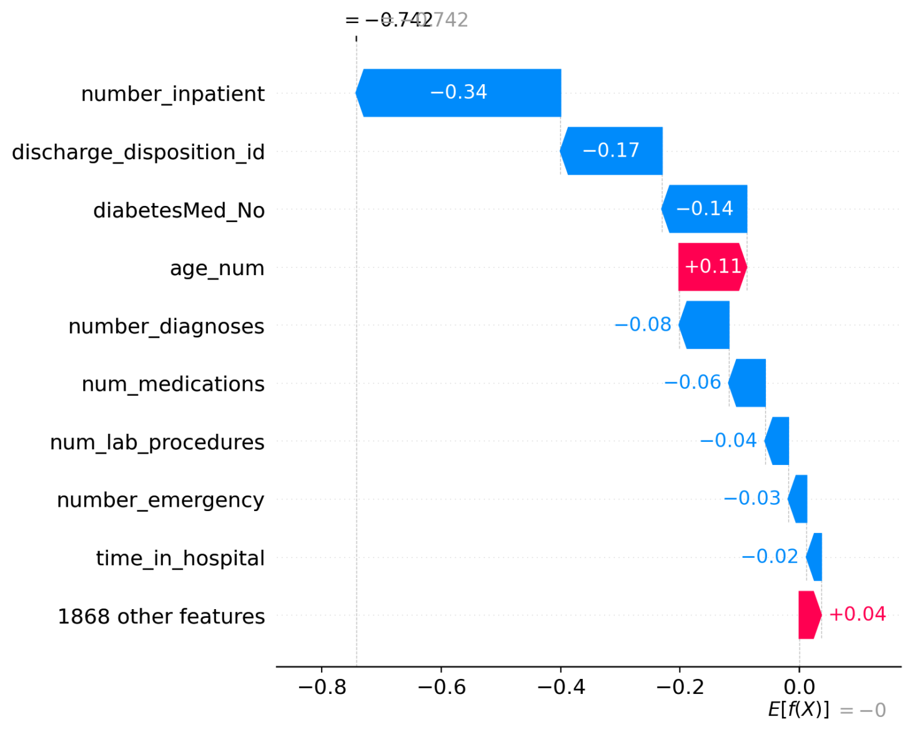
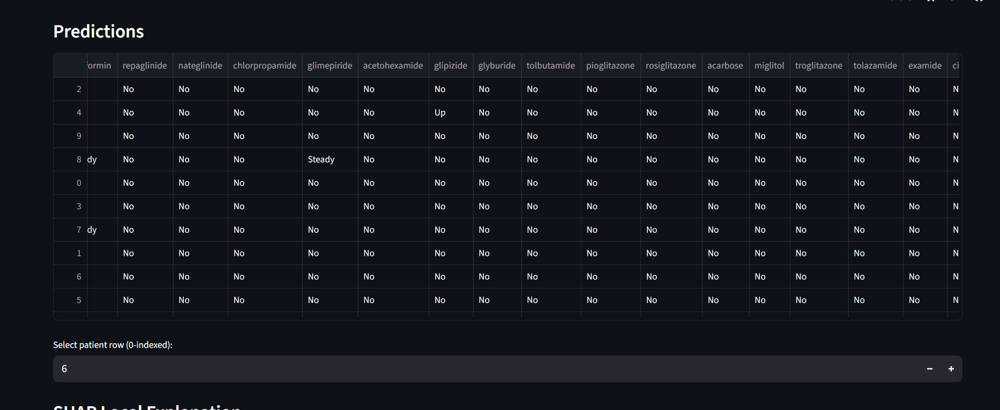

### AI-Powered Patient Readmission Prediction
Live Demo (Streamlit App):https://patient-readmission-prediction-twaodhqqtqs6mztdgyhkqz.streamlit.app/

##  Overview
Hospital readmissions are costly and often preventable. This project predicts the likelihood of a patient being readmitted within 30 days using machine learning (XGBoost) and provides explainable AI insights using SHAP.
The system:
Identifies patients at high risk of readmission.
Explains why the prediction was made (top contributing factors).
Provides GenAI-driven recommendations for reducing readmission.

## Features
- **End-to-End Pipeline –** Data cleaning, feature engineering, model training, and evaluation.
- **Explainable AI (XAI) –** SHAP plots for global and local feature importance.
- **Interactive Dashboard –** Built with Streamlit for live predictions and risk visualization.
- **GenAI Recommendations –** Natural-language recommendations for healthcare professionals.

## Project Structure

 **README.md**   --               Complete project documentation -----
 **requirements.txt**    --       List of dependencies -----
 **app.py**                 --     Streamlit dashboard -----
 **sample_patients.csv**  --       Sample cleaned test data -----
**data**                  --  Data folder -----
**models**                --    Trained models and artifacts -----
**notebooks**             --     Jupyter notebooks for analysis -----
**src**                   --     Source code -----
**screenshots**           --     Images for README
 

##  Tech Stack
- **Language:** Python
- **Machine Learning:** XGBoost, Scikit-learn
- **Data Processing:** Pandas, NumPy
- **Visualization:** Matplotlib, Plotly
- **Explainability:** SHAP
- **Web App:** Streamlit
- **Version Control:** Git/GitHub

# Screenshots

### Dashboard

### SHAP Local Explanation

### prediction

